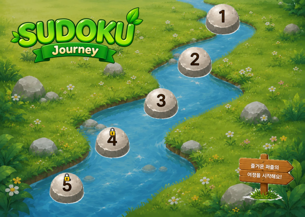

# SUDOKU Journey

시냇물을 따라 놓인 돌다리를 하나씩 건너며 푸는 스도쿠 게임입니다.
단계를 클리어할 때마다 다음 돌의 잠금이 풀리고, 진행 상황은 브라우저에 자동 저장됩니다.

**플레이:** https://kaylasong1.github.io/sudoku-game/



## 특징

- **스테이지 진행 방식** — 난이도별로 돌다리를 순서대로 건너며 진행
- **난이도 3단계** — 쉬움 / 보통 / 어려움, 각 5문제
- **시드 기반 퍼즐 생성** — 같은 스테이지는 언제 들어와도 같은 문제
- **자동 저장** — localStorage에 진행도 기록, 설치 없이 이어서 플레이
- **반응형** — 데스크톱과 모바일에 각각 맞춘 배경으로 전환

## 폴더 구조

```
sudoku-game/
├── index.html          진입점
├── final_preview.png   미리보기 이미지
└── assets/
    ├── README.md       에셋 상세 가이드 (파일 목록 · 좌표 · 색상값)
    ├── bg/             배경 — 데스크톱 / 모바일
    ├── stones/         스테이지 돌, 선택 · 잠금 효과, 자물쇠 아이콘
    ├── ui/             타이틀 로고, 나무 안내판
    └── ref/            디자인 참고용 (구현에는 사용하지 않음)
```

에셋을 다루기 전에 [`assets/README.md`](assets/README.md)를 먼저 확인해 주세요.
파일별 크기, 상태 조합 규칙, 스테이지 좌표, 색상 토큰이 정리되어 있습니다.

## 개발 메모

- 전체 에셋은 **WebP** 포맷입니다. PNG 대비 약 88% 가벼워, 전체 용량이 5.4MB에서 628KB로 줄었습니다.
- 에셋 경로는 **상대경로**로만 작성합니다. GitHub Pages는 하위 경로로 서빙되기 때문에 `/assets/...`처럼 슬래시로 시작하면 404가 납니다.
- 파일명 **대소문자를 구분**합니다. 로컬에서 열리던 이미지가 배포 후 안 보인다면 대부분 이 문제입니다.
- `assets/ref/`의 난이도 패널과 초기화 버튼은 **이미지로 사용하지 않습니다.** 진행도 숫자가 바뀌고 선택 상태가 필요하므로 CSS로 구현합니다.

## 만든 사람

Kayla Song ([@kaylasong1](https://github.com/kaylasong1))
